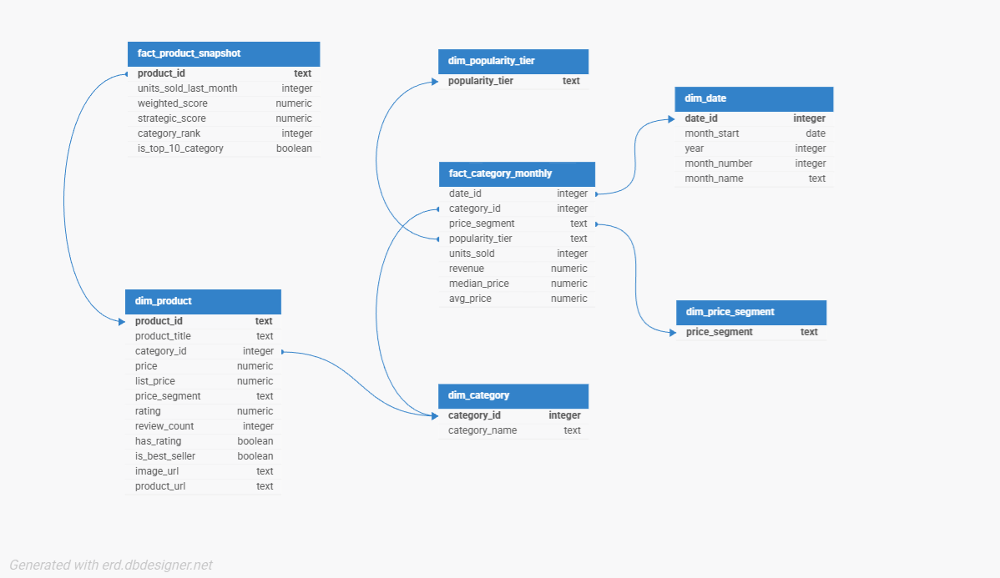

# Índice Geral do Case

Este documento centraliza todos os links e evidências exigidos para avaliação.

---

## 🔹 Planejamento (PMBOK)

Documento:
[Link para planejamento]

Print:
[Inserir print]

---

## 🔹 Base de Dados

Dataset utilizado:
Amazon Products Dataset 2023 (1.4M Products)

Link:
https://www.kaggle.com/datasets/asaniczka/amazon-products-dataset-2023-1-4m-products

---

## 🔹 Integrar

Ativo na Dadosfera:
[Link]

Print do Dataset carregado:
[Inserir imagem]

---

## 🔹 Explorar

Dicionário de Dados:
[Link]

Print do Catálogo:
[Inserir imagem]

---

## 🔹 Data Quality

Relatório gerado com:

- Great Expectations / Soda

Print:
[Inserir imagem]

---

## 🔹 GenAI / LLM

Notebook:
[Link]

Print das features geradas:
[Inserir imagem]

---

## 🔹 Modelagem

Diagrama:

Link:
https://dbdesigner.page.link/9HjidL4vzZvz1yC1A

---

## 🔹 Dashboard

Coleção:
<Nome Sobrenome - Mes_Ano>

SQL utilizada:
[Link ou arquivo]

Print do dashboard:
[Inserir imagem]

---

## 🔹 Pipeline

Ativo cadastrado:
[Link]

Print:
[Inserir imagem]

---

## 🔹 Data App

Link do Streamlit:
[Inserir link]

Print:
[Inserir imagem]

---

## 🔹 Apresentação

Link do YouTube (Unlisted):
[Inserir link]
