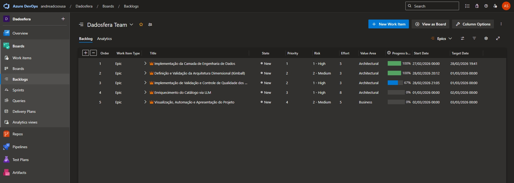
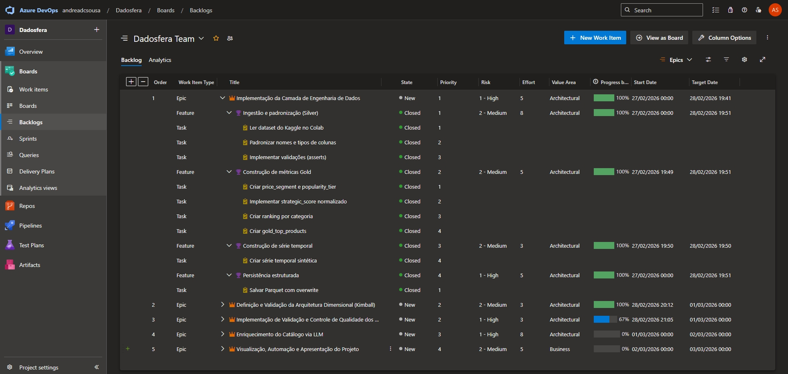
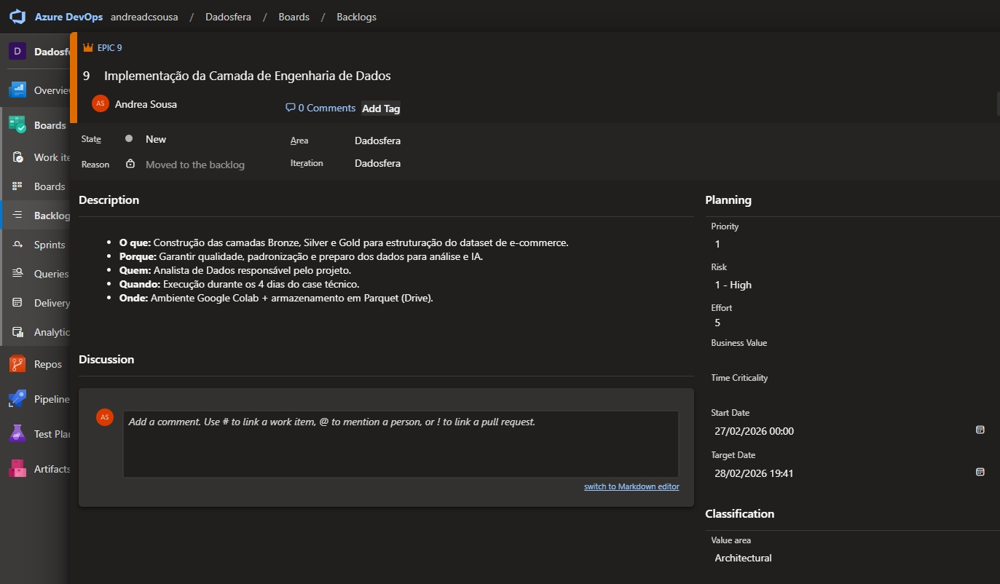

# Planejamento do Projeto (PMBOK)

## 🎯 Objetivo

Construir uma Prova de Conceito de Plataforma de Dados utilizando a Dadosfera SaaS, capaz de substituir arquiteturas fragmentadas e centralizar ingestão, processamento, modelagem e IA aplicadas a um catálogo de e-commerce com mais de 1,5 milhão de produtos.

## 📌 Escopo

### Inclui

- Ingestão de dados (>1M registros)
- Tratamento e padronização (STANDARDIZED)
- Modelagem analítica (CURATED - Data Warehouse Dimensional)
- Geração de série temporal
- Extração de features via LLM
- Criação de Dashboard analítico
- Criação de Data App com Streamlit
- Pipeline automatizado
- Apresentação executiva

### Não inclui

- Deploy produtivo em ambiente corporativo real
- Integração com ERP/CRM externo
- Monitoramento contínuo em produção

## 📂 Estrutura Analítica

1. Planejamento
2. Ingestão e Integração
3. Tratamento e Padronização
4. Modelagem de Dados
5. Enriquecimento com IA
6. Análise e Visualização
7. Desenvolvimento de Data App
8. Pipeline e Catalogação
9. Apresentação Executiva

## 🔁 Alinhamento ao Ciclo de Vida da Dadosfera

O planejamento foi estruturado seguindo as fases:

- **Integrar:** Ingestão (RAW)
- **Processar:** Padronização e Enriquecimento (STANDARDIZED + LLM)
- **Explorar:** Catalogação e organização em camadas
- **Analisar:** Dashboards e consultas SQL
- **ML/AI:** Extração de features estruturadas via LLM
- **Data Apps:** Aplicação Streamlit

## 📌 Metodologia de Gestão

O projeto foi estruturado utilizando abordagem Agile/Kanban, com organização em Epics, Features e Tasks no Azure Devops.

**Colunas utilizadas:** `New | Active | Resolved | Closed`

> [!NOTE]
> A organização por Epics permitiu controle incremental da entrega e mitigação de riscos dentro do prazo estabelecido (5 dias corridos)

## 📅 Cronograma

| Dia | Entregas                | Fase PMBOK    |
| --- | ----------------------- | ------------- |
| 1   | Ingestão + STANDARDIZED | Execução      |
| 2   | CURATED + Modelagem     | Execução      |
| 3   | LLM + Dashboard         | Execução      |
| 4   | Data App + Consolidação | Monitoramento |
| 5   | Apresentação Executiva  | Encerramento  |

## ⚠️ Análise de Riscos

A análise de riscos foi conduzida considerando aspectos técnicos, estratégicos, operacionais e financeiros do projeto.

| Risco                                | Tipo        | Impacto                             | Probabilidade | Mitigação                                                     |
| ------------------------------------ | ----------- | ----------------------------------- | ------------- | ------------------------------------------------------------- |
| Alto volume de dados                 | Técnico     | Lentidão e uso excessivo de memória | Média         | Uso de tipos otimizados (float32/int32) e particionamento     |
| Dataset sem data real                | Técnico     | Limitação analítica temporal        | Alta          | Geração de série temporal sintética reprodutível              |
| Custo da API LLM                     | Financeiro  | Aumento de custo inesperado         | Média         | Uso de amostra estratificada e controle de chamadas           |
| Prazo curto (4 dias)                 | Cronograma  | Entrega incompleta                  | Média         | Planejamento incremental e priorização de entregas essenciais |
| Complexidade excessiva da solução    | Estratégico | Dificuldade de explicação           | Baixa         | Foco em arquitetura clara e modular                           |
| Dependência de ferramentas externas  | Operacional | Bloqueio técnico                    | Baixa         | Uso de alternativas locais (DuckDB, Colab)                    |
| Desalinhamento com critérios do case | Estratégico | Penalização na avaliação            | Baixa         | Revisão contínua do enunciado e checklist de requisitos       |
| Endpoint PostgreSQL público          | Técnico     | Indisponibilidade temporária        | Baixa         | Uso de provedor estável e backup local                        |

## 🔗 Interdependências do Projeto

A estrutura de dependências foi planejada para garantir evolução incremental e minimizar retrabalho, respeitando a hierarquia técnica das camadas de dados.

O fluxo de dependências segue a lógica das camadas analíticas e do ciclo de vida de dados:

### 🧱 Camadas de Engenharia

- **Silver → Gold:** A camada Gold depende da padronização, tipagem e validação realizadas na Silver.
- **Silver → LLM:** O enriquecimento via LLM utiliza dados estruturados e consistentes provenientes da Silver.

### 📊 Camadas Analíticas

- **Gold → Dashboard:** O dashboard consome exclusivamente métricas consolidadas da camada Gold.
- **Gold + LLM → Data App:** O Data App integra métricas analíticas (Gold) e atributos enriquecidos (LLM).

### 🎥 Entrega Final

- **Todos os componentes → Apresentação Executiva:** A apresentação depende da consolidação de todas as etapas anteriores, garantindo narrativa coerente e evidências reprodutíveis.

## 💰 Estimativa de Custos (Simulação)

- Infraestrutura Dadosfera: modelo SaaS (licenciamento simplificado)
- PostgreSQL Cloud (Free Tier)
- Processamento LLM: custo variável por token (controlado por amostragem)
- Streamlit Cloud: Free Tier
- Ambiente Colab: Gratuito

> [!IMPORTANT]
> **Estimativa:** Baixo custo inicial comparado à arquitetura distribuída tradicional.

## 📊 Indicadores de Sucesso

O projeto será considerado bem-sucedido se:

- Dados estruturados em camadas Bronze, Silver e Gold
- Modelo dimensional validado (DDL executado com sucesso)
- Dashboard contendo no mínimo 5 visualizações distintas
- LLM gerando atributos estruturados reutilizáveis
- Pipeline cadastrado e executável
- Data App funcional publicado

## 🎯 Pontos Críticos

Os pontos críticos representam fatores que podem comprometer qualidade, clareza arquitetural ou avaliação técnica do case. Estes pontos foram monitorados ao longo do projeto como critérios de controle de qualidade.

### 🧱 Consistência do Schema

A integridade entre Bronze, Silver e Gold deve ser mantida, garantindo:

- Tipagem consistente
- Ausência de colunas ambíguas
- Integridade de chaves no modelo dimensional

### 🤖 Controle de Custo e Volume da LLM

O enriquecimento via LLM deve:

- Utilizar amostra estratificada
- Minimizar chamadas desnecessárias
- Produzir atributos reutilizáveis

### 🔍 Rastreabilidade das Transformações

Todas as transformações devem ser:

- Reprodutíveis via notebooks
- Documentadas no GitHub
- Separadas por camadas (Silver / Gold / Enriched)

### 📚 Clareza e Reprodutibilidade

O projeto deve permitir que um avaliador:

- Execute os notebooks sem ajustes manuais
- Compreenda a arquitetura através do índice
- Navegue facilmente entre documentos e evidências

## 📊 Justificativa Estratégica

O planejamento foi estruturado para demonstrar como a Dadosfera pode reduzir complexidade arquitetural, centralizando ingestão, processamento, modelagem, IA e visualização em uma única plataforma.

A proposta demonstra viabilidade técnica e financeira frente a arquiteturas tradicionais baseadas em múltiplos serviços distribuídos (ETL dedicado, DW separado, ferramenta de BI isolada e camada de ML desacoplada).

## 📷 Evidência de Gestão no Azure DevOps

Abaixo estão evidências da organização e execução do projeto:

#### 📌 Épicos Criados

#### 📌 Hierarquia (Epic → Features → Tasks)

#### 📌 Estrutura do Épico com 5W

