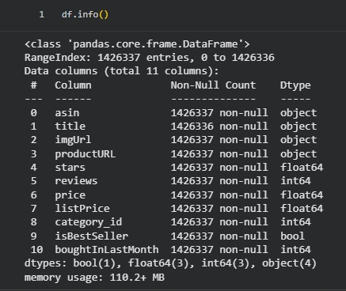

# Base de Dados

## 📊 Dataset Selecionado

**Amazon Products Dataset 2023**

O dataset foi utilizado como base para construção de um ambiente analítico completo, incluindo ingestão, tratamento, enriquecimento com IA, modelagem dimensional e consumo analítico via dashboards e Data App.

- **Total de registros:** 1.426.337 produtos
- **Volume validado na ingestão:** > 1.400.000 registros carregados na camada RAW
- **Domínio:** E-commerce (Catálogo de Produtos)
- **Fonte:** Kaggle (dataset público)
- **Formato original:** CSV estruturado
- **Granularidade:** 1 linha por produto
- **Principais atributos:** título, descrição, categoria, preço, avaliação (rating), número de reviews

## 🎯 Justificativa da Escolha

O dataset foi selecionado por:

- Escala adequada (> 1 milhão de registros), permitindo simulação realista de ambiente corporativo
- Representação consistente de um grande catálogo de e-commerce
- Presença de variáveis estratégicas para análise e modelagem:
  - Preço
  - Avaliações (rating)
  - Volume de vendas (units_sold_last_month)
  - Categoria
  - Indicador de Best Seller
- Campo textual (product_title e product_description) adequado para enriquecimento semântico via LLM
- Estrutura compatível com modelagem analítica dimensional (produto, categoria e métricas derivadas)
- Compatibilidade com arquitetura transacional (PostgreSQL) para simulação de sistema operacional
- Aderência ao cenário do case: centralização de dados, analytics e aplicação de IA em contexto de e-commerce

## 🧱 Estrutura dos Dados

Principais colunas utilizadas no projeto:

| Coluna                | Tipo    | Finalidade                                          |
| --------------------- | ------- | --------------------------------------------------- |
| product_id            | string  | Identificador único do produto (chave da dimensão)  |
| product_title         | string  | Texto base para enriquecimento semântico via LLM    |
| category_id           | integer | Chave de categorização (dimensão categoria)         |
| category_name         | string  | Nome da categoria                                   |
| price                 | float   | Preço atual (métrica analítica)                     |
| list_price            | float   | Preço original para cálculo de desconto             |
| rating                | float   | Avaliação média do produto                          |
| review_count          | integer | Volume de avaliações (proxy de popularidade)        |
| units_sold_last_month | integer | Indicador recente de vendas (métrica de desempenho) |
| is_best_seller        | boolean | Indicador estratégico de destaque comercial         |

### 🧮 Volume e Complexidade

A base apresenta características que impactam diretamente a engenharia e modelagem analítica:

- ~1,4M registros
- 10+ colunas relevantes para análise
- Campos textuais com alta cardinalidade (título e descrição)
- 248 categorias distintas
- Necessidade de estratégia de processamento escalável para suportar crescimento do volume de dados

Essas características demandam:

- Otimização de tipos numéricos (float32 / int32) para eficiência de memória
- Organização em camadas (RAW → Standardized → Curated)
- Estratégia controlada de amostragem e processamento em batch para LLM
- Separação entre dados transacionais e dados analíticos

## 🔎 Potencial Analítico

O dataset suporta múltiplas camadas analíticas:

- Identificação de categorias estratégicas e produtos de alto desempenho
- Segmentação por faixa de preço e análise de elasticidade
- Análise de performance por categoria (vendas, rating e volume de reviews)
- Construção de indicadores derivados (ticket médio, desconto percentual, popularidade)
- Geração de série temporal sintética para análise evolutiva
- Enriquecimento semântico via GenAI para criação de atributos estruturados
- Base para futuros modelos preditivos (ranking, recomendação ou propensão)

## 🏢 Conexão com o Problema de Negócio

O cenário modelado é compatível com o desafio proposto, que demanda centralização, governança e aplicação de IA em escala em contexto de e-commerce.

- A padronização do catálogo é crítica para consistência analítica e redução de retrabalho
- A análise por categoria impacta diretamente estratégia comercial e priorização de portfólio
- O enriquecimento via IA habilita segmentação inteligente e melhoria na descoberta de produtos
- A consolidação das métricas em camada analítica suporta decisões orientadas a dados
- A centralização reduz complexidade arquitetural e dependência de múltiplos serviços desacoplados

A escala e diversidade da base reforçam a necessidade de uma Plataforma de Dados integrada e governável para suportar crescimento sustentável e geração contínua de valor.

## 🔌 Estratégia de Integração

Para simular um ambiente transacional real, a base foi estruturada em um banco PostgreSQL público (cloud).

Paralelamente, a ingestão na plataforma também foi demonstrada via upload direto de arquivos estruturados (Parquet), permitindo evidenciar diferentes estratégias de integração suportadas pela plataforma.

**Essa abordagem viabiliza:**

- Integração via módulo de Coleta a partir de fonte relacional
- Aplicação de microtransformações ainda na camada de ingestão
- Criação de pipelines escaláveis com separação entre origem e camada analítica
- Organização em camadas (RAW → Standardized → Curated)
- Simulação de fluxo próximo ao cenário corporativo (sistema operacional → plataforma analítica)

## 📷 Evidências da Base

Evidências da ingestão e estrutura do dataset no Google Colab:

#### 📌 Leitura do dataset:

#### 📌 Head do dataset

#### 📌 Informações do dataset

#### 📌 Dataset carregado na Dadosfera (RAW)

