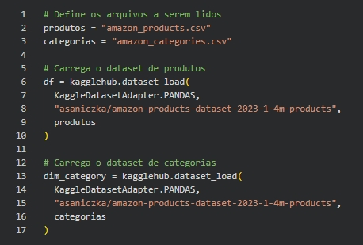
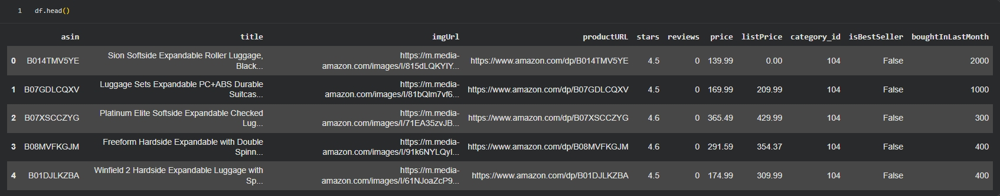

# Base de Dados

## 📊 Dataset Selecionado

**Amazon Products Dataset 2023**

- **Total de registros:** 1.426.337 produtos
- **Domínio:** E-commerce
- **Fonte:** Kaggle (Dataset público)
- **Formato original:** CSV

## 🎯 Justificativa da Escolha

O dataset foi selecionado por:

- Escala adequada (> 1 milhão de registros)
- Representação realista de um grande catálogo de e-commerce
- Presença de variáveis relevantes para análise estratégica:
  - Preço
  - Avaliações (rating)
  - Volume de vendas (units_sold_last_month)
  - Categoria
  - Indicador de Best Seller
- Campo textual (product_title) adequado para enriquecimento via LLM

## 🧱 Estrutura dos Dados

Principais colunas utilizadas no projeto:

| Coluna                | Tipo    | Finalidade                        |
| --------------------- | ------- | --------------------------------- |
| product_id            | string  | Identificador único do produto    |
| product_title         | string  | Texto para enriquecimento via LLM |
| category_id           | integer | Chave de categorização            |
| category_name         | string  | Nome da categoria                 |
| price                 | float   | Preço atual                       |
| list_price            | float   | Preço original                    |
| rating                | float   | Avaliação média                   |
| review_count          | integer | Volume de avaliações              |
| units_sold_last_month | integer | Indicador de vendas               |
| is_best_seller        | boolean | Indicador estratégico             |

### 🧮 Volume e Complexidade

A base apresenta características que impactam diretamente a engenharia de dados:

- 1,4M registros
- 10+ colunas relevantes
- Campo textual com alta cardinalidade
- 248 categorias distintas

Essas características demandam:

- Otimização de tipos (float32 / int32)
- Estruturação em camadas (Bronze → Silver → Gold)
- Estratégia controlada de amostragem para LLM

## 🔎 Potencial Analítico

O dataset suporta múltiplas camadas analíticas:

- Análise estrutural de catálogo
- Segmentação por faixa de preço
- Performance por categoria
- Geração de série temporal sintética
- Enriquecimento via GenAI

## 🏢 Conexão com o Problema de Negócio

Esse cenário é compatível com o desafio proposto no case, que exige centralização, governança e aplicação de IA em escala.

- A padronização do catálogo é crítica
- A análise por categoria impacta estratégia comercial
- O enriquecimento via IA habilita segmentação inteligente
- A centralização de dados reduz complexidade arquitetural

## 📷 Evidências da Base

- Print da leitura do dataset no Google Colab
- Print do `.info()` demonstrando volume e tipagem
- Print de `df.head()` com amostra real

Abaixo, evidências da ingestão e estrutura do dataset no Google Colab:

### 📌 Leitura do dataset:

### 📌 Head do dataset

### 📌 Informações do dataset

