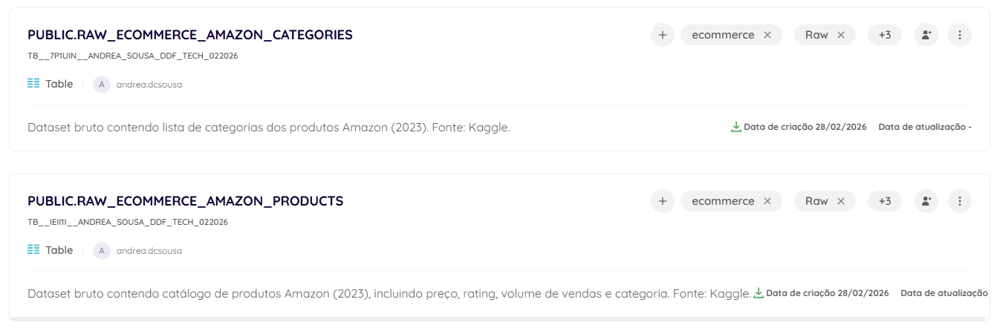
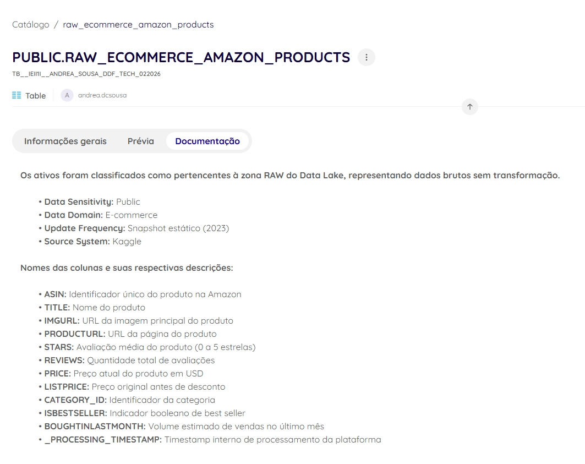
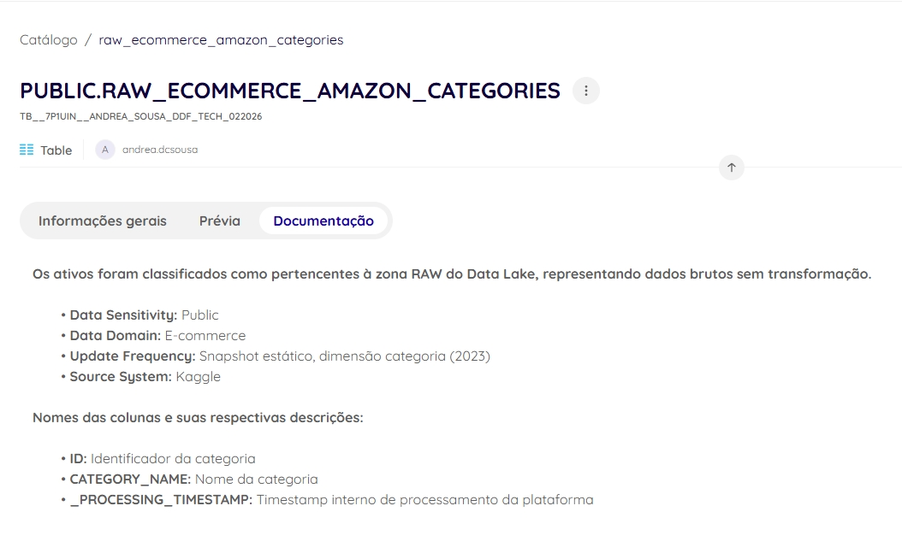
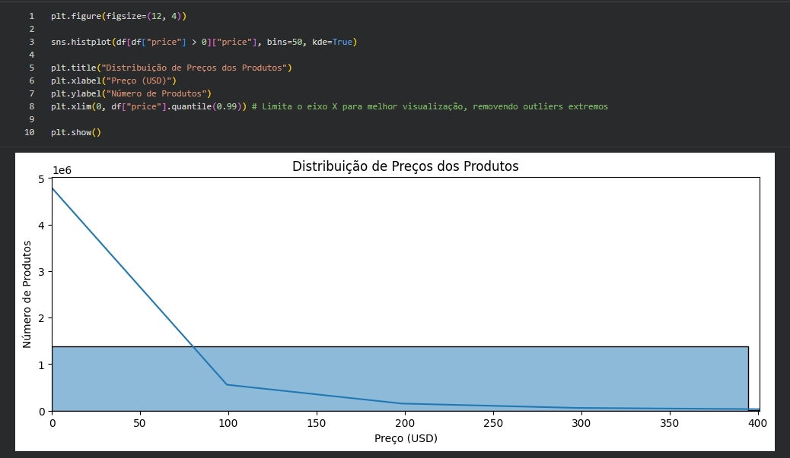
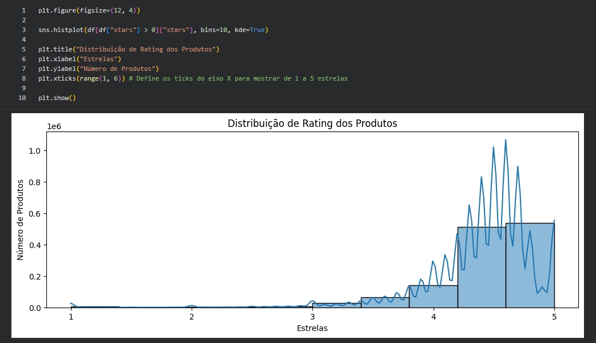
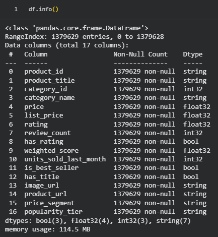
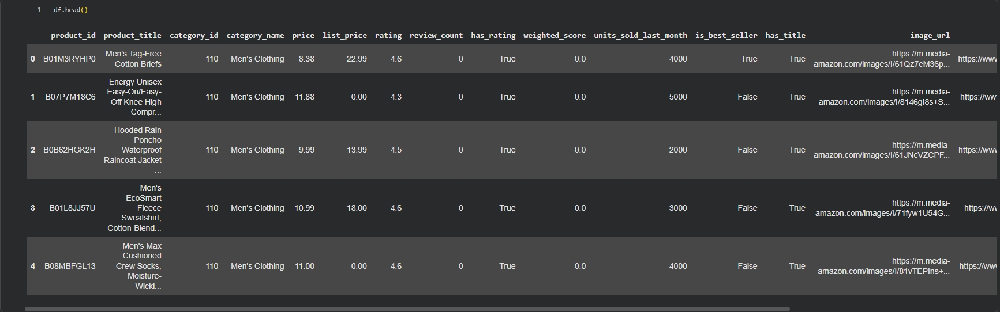

# Integrar e Explorar

Este documento descreve as etapas de integração na plataforma Dadosfera, governança, ingestão técnica, exploração e construção da camada Silver do dataset de e-commerce.

## 🔌 Integração na Plataforma Dadosfera (Zona RAW)

Os arquivos originais foram carregados utilizando o módulo **Coletar** da Dadosfera, conforme solicitado no case técnico. Foram realizadas as seguintes ações:

- Upload dos arquivos originais (Produtos e Categorias)
- Criação automática de ativos no **Catálogo**
- Padronização dos nomes técnicos dos ativos
- Classificação na zona **RAW** do Data Lake

### 📂 Ativos Criados

- `RAW_ECOMMERCE_AMAZON_PRODUCTS`
- `RAW_ECOMMERCE_AMAZON_CATEGORIES`

### 📸 Evidências:

#### 📌 Upload no catálogo da Dadosfera

> [!WARNING]
> A plataforma aceita arquivos com limite de até **250MB** por upload.
>
> O arquivo CSV principal de produtos ultrapassava esse tamanho.
> Para viabilizar o carregamento, foi realizada a conversão para formato **Parquet**, utilizando a ferramenta:
> https://observablehq.com/@observablehq/csv-to-parquet
>
> A conversão reduziu significativamente o tamanho do arquivo, permitindo o upload sem perda estrutural.

> [!TIP]
> O uso de Parquet está alinhado com boas práticas de Data Lake, por ser um formato colunar, comprimido e otimizado para processamento analítico.

## 🏷️ Catalogação e Governança

Após o carregamento, foram aplicadas boas práticas de governança de dados:

- Descrição detalhada do ativo preenchida
- Aplicação de tags (ecommerce, raw, catalog, case-tecnico)
- Definição de owner
- Documentação do **Dicionário de Dados** (descrição das colunas)

### 📘 Dicionário de Dados – Products

| Coluna                 | Descrição                                |
| ---------------------- | ---------------------------------------- |
| ASIN                   | Identificador único do produto na Amazon |
| TITLE                  | Nome do produto                          |
| IMGURL                 | URL da imagem principal                  |
| PRODUCTURL             | URL da página do produto                 |
| STARS                  | Avaliação média do produto (0 a 5)       |
| REVIEWS                | Quantidade total de avaliações           |
| PRICE                  | Preço atual em USD                       |
| LISTPRICE              | Preço original antes de desconto         |
| CATEGORY_ID            | Identificador da categoria               |
| ISBESTSELLER           | Indicador booleano de best seller        |
| BOUGHTINLASTMONTH      | Volume estimado de vendas no último mês  |
| \_PROCESSING_TIMESTAMP | Timestamp interno gerado pela plataforma |

### 📘 Dicionário de Dados – Categories

| Coluna                 | Descrição                                |
| ---------------------- | ---------------------------------------- |
| ID                     | Identificador único da categoria         |
| CATEGORY_NAME          | Nome textual da categoria                |
| \_PROCESSING_TIMESTAMP | Timestamp interno gerado pela plataforma |

### 📸 Evidências:

#### 📌 Descrição dos ativos

## 🗂️ Organização em Camadas (Data Lake)

Os dados foram organizados seguindo o padrão clássico de Data Lake:

- **RAW** → Dados brutos carregados diretamente da fonte (Kaggle), sem transformação
- **SILVER** → Dados tratados, padronizados e tipados (processados via Python)
- **GOLD** → Dados agregados e prontos para consumo analítico

> [!NOTE]
> Os ativos presentes na Dadosfera representam a camada **RAW**.

## 📥 Ingestão Técnica (Colab)

### 📌 Fonte de Dados

- Dataset: Amazon Products Dataset 2023
- Origem: Kaggle
- Formato original: CSV
- Volume: 1.426.337 registros

### 🛠️ Ambiente Utilizado

- Google Colab
- Python (pandas, pyarrow)
- Persistência em Parquet

## 🔎 Exploração Inicial (EDA)

Foram realizadas análises exploratórias para compreender qualidade e distribuição dos dados:

- Distribuição de preços
- Distribuição de ratings
- Identificação de produtos sem preço
- Identificação de produtos com rating zero
- Análise de cardinalidade por categoria

Essas análises subsidiaram decisões de:

- Segmentação de preço
- Estratégia de ranking
- Definição de métricas de popularidade
- Estratégia de amostragem para LLM

### 📸 Evidências:

#### 📌 Gráfico de distribuição de preços

#### 📌 Gráfico de distribuição de ratings

## 🧹 Tratamento e Padronização (Camada Silver)

### 🔤 Padronização de Nomes

- asin → product_id
- title → product_title
- reviews → review_count
- boughtInLastMonth → units_sold_last_month

### 🧮 Otimização de Tipos

- float64 → float32
- int64 → int32
- object → string
- Criação de colunas booleanas

### 📊 Criação de Novas Variáveis

- price_segment
- has_rating
- weighted_score
- popularity_tier

## 🔁 Garantia de Reprocessamento

Antes da persistência, o diretório Parquet é removido para evitar duplicidade de dados. Essa estratégia garante:

- Overwrite controlado
- Idempotência do pipeline
- Reprocessamento seguro

## 📤 Saída da Camada Silver

DataFrame final estruturado:

- 1.379.629 registros válidos
- 17 colunas estruturadas
- Tipagem otimizada
- Sem nulos críticos

### 📸 Evidências:

#### 📌 Estrutura final (.info)

#### 📌 Head do DataFrame Silver

