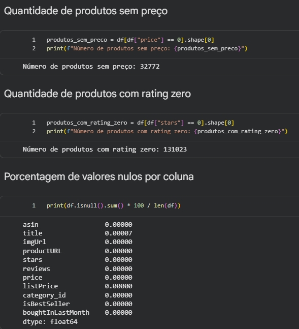

# Data Quality

Este documento apresenta a estratégia de qualidade de dados aplicada após a ingestão na camada RAW e antes da modelagem na camada Curated, garantindo governança, rastreabilidade e confiabilidade analítica.

## 🎯 Objetivo da Análise de Qualidade

Garantir que o dataset esteja consistente, íntegro e adequado para:

- Modelagem dimensional (abordagem Kimball)
- Construção de métricas analíticas confiáveis
- Enriquecimento semântico via LLM
- Consumo por dashboards e Data App

## 🧪 Estratégia de Validação Automatizada

A estratégia de qualidade foi estruturada de forma compatível com frameworks de validação de dados como Great Expectations ou Soda-Core, permitindo formalização de regras, execução automatizada de testes e rastreabilidade das verificações aplicadas.

**As verificações incluíram:**

- Expectativas de domínio (rating entre 0 e 5)
- Expectativa de unicidade (product_id único)
- Expectativas de completude (campos críticos não nulos)
- Expectativas de consistência referencial (category_id existente na dimensão categoria)
- Verificação de tipagem consistente após padronização

## 📊 Análise de Completude (Nulos)

Nenhuma coluna crítica apresentou percentual de nulos superior ao limiar aceitável de 5%.

### 🔍 Verificação de valores ausentes

Foi executada análise de nulos por coluna:

- product_title → percentual residual baixo, mantido para enriquecimento
- price → identificação de valores zero tratados como inconsistência comercial
- rating → presença de valores zero interpretados como ausência de avaliação
- review_count → ausência de nulos críticos
- demais colunas → sem nulos relevantes para modelagem

### 📷 Evidência

#### 📌 Análise de Nulos

## 📈 Análise de Distribuição

Outliers extremos foram identificados, porém mantidos para preservar integridade do domínio original e evitar distorção artificial dos dados.

### 💰 Preço

- Preço mínimo: $0.00
- Preço máximo: ~$19.731
- Forte concentração na faixa inferior a $100
- Valores zero sinalizados como possível inconsistência comercial

### ⭐ Rating

- Alta concentração entre 4.0 e 5.0
- 131.023 produtos com rating igual a zero
- Distribuição assimétrica, indicando viés positivo comum em marketplaces

### 📷 Evidências

#### 📌 Distribuição de Preços

#### 📌 Distribuição de Ratings

### 🔎 Validação de Domínio

- rating dentro do intervalo esperado (0 a 5)
- price ≥ 0 (valores zero identificados como possíveis inconsistências comerciais)
- review_count ≥ 0
- units_sold_last_month ≥ 0

## 🧮 Padronização e Otimização de Tipagem (Standardized)

Nesta etapa são verificadas e confirmadas as otimizações de tipagem realizadas durante a preparação da camada Standardized.

**Foram aplicadas otimizações:**

- float64 → float32
- int64 → int32
- object → string
- Conversão explícita de flags para boolean

**Objetivo:**

- Redução de uso de memória
- Melhor performance em processamento analítico
- Padronização consistente para modelagem dimensional

## 🏷️ Análise de Integridade

- product_id validado como chave única (sem duplicidade)
- category_id consistente com tabela de categorias (validação via merge)
- Ausência de registros duplicados após tratamento
- Coerência entre price e list_price (quando aplicável)

## 📋 Regras de Qualidade Definidas

| Regra                  | Tipo        | Critério                                |
| ---------------------- | ----------- | --------------------------------------- |
| product_id único       | Integridade | Sem duplicidade                         |
| rating entre 0 e 5     | Domínio     | Valores fora do intervalo são inválidos |
| price >= 0             | Domínio     | Valores negativos inválidos             |
| review_count >= 0      | Domínio     | Valores negativos inválidos             |
| category_id válido     | Referencial | Deve existir na tabela Categories       |
| product_title não nulo | Completude  | Campo obrigatório                       |

## ⚠️ Pontos de Atenção

- Produtos com preço igual a zero podem representar:
  - Produtos descontinuados
  - Erro de origem
  - Estratégias promocionais específicas
- Rating igual a zero pode indicar ausência de avaliações, e não necessariamente baixa qualidade
- Dataset não possui dimensão temporal real, exigindo geração sintética para análises evolutivas

## ✅ Conclusão da Qualidade

Após as verificações realizadas, o dataset apresenta:

- Consistência estrutural
- Integridade referencial validada
- Tipagem otimizada para performance
- Conformidade com regras de domínio e completude
- Adequação para modelagem dimensional
- Estrutura apropriada para enriquecimento via LLM

O dataset está apto para evolução para a camada Curated e posterior materialização das transformações por meio de pipelines automatizados.

> [!NOTE]
> Os riscos identificados foram documentados e considerados nas decisões arquiteturais subsequentes.

## 🔁 Reprodutibilidade

Todas as verificações foram executadas via notebook [ETL de Ingestão e Limpeza](../notebooks/01_etl_ingestao_limpeza.ipynb), permitindo reprocessamento completo, auditoria técnica e rastreabilidade das transformações.
