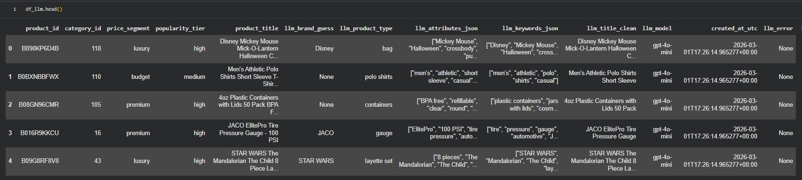

# Processar com GenAI (LLM Feature Extraction)

Esta etapa tem como objetivo enriquecer o dataset estruturado com informações extraídas a partir de dados não estruturados (campo `product_title`), utilizando um modelo de linguagem (LLM).

## 🎯 Objetivo

Transformar títulos de produtos (texto livre) em atributos estruturados reutilizáveis para:

- Segmentação avançada
- Análise por tipo de produto
- Inferência de marca
- Enriquecimento para dashboards
- Base para recomendações futuras

## 🧠 Estratégia de Processamento

### 🔎 Entrada

Camada **Silver** contendo:

- product_id
- category_id
- product_title
- price_segment
- popularity_tier

### 📤 Saída

Tabela enriquecida contendo:

- llm_brand_guess
- llm_product_type
- llm_attributes_json
- llm_keywords_json
- llm_title_clean
- llm_model
- created_at_utc
- llm_error (controle)

## 📊 Estratégia de Amostragem

Como o dataset possui mais de 1.4M registros, foi adotada uma estratégia de **amostragem estratificada** para controle de custo e tempo de execução.

Critérios utilizados:

- Seleção das categorias mais frequentes
- Amostragem por combinação de:
  - category_id
  - price_segment
  - popularity_tier

A amostra final foi limitada para manter eficiência computacional e controle financeiro.

Parâmetros utilizados nesta execução:

- TOP_CATEGORIES = 40
- K_PER_GROUP = 3
- MAX_SAMPLE = 400

> [!NOTE]
> Essa abordagem é adequada para casos de prova de conceito e demonstração arquitetural.

### 📷 Evidências

#### 📌 Shape do sample:

## 🧾 Prompt Engineering

O modelo foi instruído a retornar exclusivamente JSON estruturado com os seguintes campos:

- brand_guess
- product_type
- attributes (lista)
- keywords (lista)
- title_clean

Boas práticas adotadas:

- temperature = 0 (determinismo e consistência)
- max_tokens limitado para controle de custo
- Validação e parsing seguro de JSON
- Retry automático com backoff exponencial
- Logging de falhas por registro (llm_error)
- Limite de tamanho de listas (attributes ≤ 6, keywords ≤ 6)

### 📷 Evidências

#### 📌 Prompt Definition:

## ⚙️ Modelo Utilizado

- **Modelo:** `gpt-4o-mini`
- **Motivo da escolha:**
  - Boa relação custo/benefício
  - Capacidade adequada para extração estruturada
  - Performance satisfatória para processamento em lote
  - Latência adequada para PoC

## ✅ Validação do Resultado

- Registros processados: 400
- Sucesso: 400
- Falhas registradas (llm_error): 0

Validações realizadas:

- Retorno exclusivo em JSON
- Presença obrigatória de todos os campos esperados
- Limitação de tamanho das listas
- Inspeção manual de amostra (5 registros) para validação semântica

### 📷 Evidências

#### 📌 Enriched Dataframe Preview:

## 📂 Persistência

A saída foi salva em formato **Parquet** (dataset/pasta com arquivos `part-*.parquet`) em:

- `/content/drive/MyDrive/Colab Notebooks/dadosfera/amazon_products_enriched_llm/`

Essa camada pode ser:

- Unida à Silver via product_id
- Utilizada para geração de métricas Gold
- Consumida por Data Apps
- Integrada a dashboards analíticos

### 📷 Evidências

#### 📌 Parquet Saved Confirmation:

## 🧱 Organização no Data Lake

Após esta etapa, o fluxo de dados passa a ser:

`RAW → SILVER → ENRICHED (LLM) → GOLD`

> [!IMPORTANT]
> ENRICHED = Silver + features semânticas via LLM.
> Essa camada não substitui a Silver, apenas a estende semanticamente.

## 🔁 Reprodutibilidade

O processo é totalmente reexecutável via notebook: [Processar GenAI LLM Features](../notebooks/03_processar_genai_llm_features.ipynb)

A execução inclui:

1. Leitura da camada Silver
2. Aplicação da estratégia de amostragem
3. Chamada à API OpenAI
4. Validação da resposta
5. Persistência em Parquet

### 📷 Evidências

#### 📌 Execution Progress Bar:

#### 📌 Execution Summary:

## ⚠️ Limitações

- O processamento foi realizado sobre amostra controlada (PoC).
- Para cobertura completa (1.4M registros), seria necessário:
  - Execução em lotes
  - Monitoramento de custo
  - Controle de taxa (rate limit)
  - Orquestração via pipeline produtivo

## 💰 Estimativa de Custo (LLM)

- Modelo: `gpt-4o-mini`
- Registros processados: 400
- Sucesso: 400
- Falhas: 0

### Tokens (estimativa conservadora)

- Tokens médios de entrada por chamada: ~350
- Tokens médios de saída por chamada: ~180
- Tokens totais estimados (entrada): ~140,000
- Tokens totais estimados (saída): ~72,000

> [!IMPORTANT]
> Valores estimados por heurística com base no tamanho médio do prompt e do JSON retornado. O consumo real pode variar conforme o conteúdo dos títulos processados.

### 📷 Evidências

#### 📌 Cost Estimation Output:

## ✅ Resultado

A camada ENRICHED adiciona inteligência semântica ao dataset estruturado, permitindo análises descritivas e prescritivas mais avançadas e ampliando o potencial analítico da plataforma de dados construída no case.
