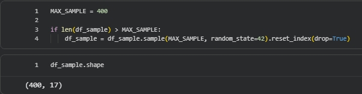
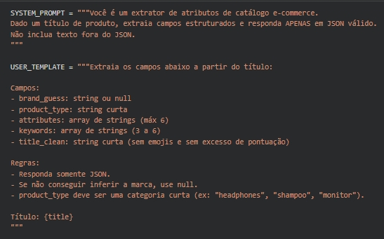
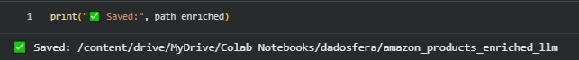
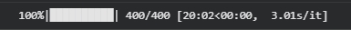
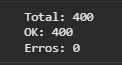
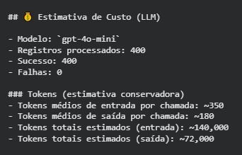

# Processar com GenAI (LLM Feature Extraction)

Esta etapa tem como objetivo enriquecer o dataset estruturado com informações extraídas a partir de dados não estruturados (campo <u>product_title</u>), utilizando modelo de linguagem (LLM) para geração de atributos semânticos estruturados.

## 🎯 Objetivo

Transformar títulos de produtos (texto livre) em atributos estruturados e persistidos na camada analítica, permitindo:

- Segmentação avançada por tipo e subcategoria inferida
- Análise por tipo de produto
- Inferência de marca
- Identificação de material ou características técnicas
- Enriquecimento para dashboards analíticos
- Base para futuros modelos de recomendação ou similaridade

## 🧠 Estratégia de Processamento

### 📥 Entrada

**Camada Standardized contendo:**

- product_id
- category_id
- product_title
- price_segment
- popularity_tier
- weighted_score

### 📤 Saída

**Tabela enriquecida contendo:**

- llm_brand_guess
- llm_product_type
- llm_attributes_json
- llm_keywords_json
- llm_title_clean
- llm_model
- created_at_utc
- llm_error (campo de controle e rastreabilidade)

> [!NOTE]
> O processamento foi executado inicialmente em ambiente controlado para validação técnica e controle de custo. A arquitetura proposta prevê a orquestração dessa etapa via pipeline.

## 📊 Estratégia de Amostragem

Considerando o volume superior a 1.4M registros, foi adotada estratégia de **amostragem estratificada** para controle de custo, tempo de execução e consumo de tokens.

**Critérios utilizados:**

- Seleção das categorias com maior representatividade
- Amostragem por combinação de:
  - category_id
  - price_segment
  - popularity_tier
- Priorização de produtos com maior relevância analítica (weighted_score)

> [!IMPORTANT]
> A amostra foi limitada para manter eficiência computacional, controle financeiro e viabilidade da prova de conceito.

**Parâmetros utilizados nesta execução:**

- TOP_CATEGORIES = 40
- K_PER_GROUP = 3
- MAX_SAMPLE = 400

Essa abordagem é adequada para cenário de prova de conceito, garantindo representatividade sem comprometer governança de custo.

### 📷 Evidências

#### 📌 Shape do sample:

## 🧾 Prompt Engineering

O modelo foi instruído a retornar exclusivamente JSON estruturado contendo os seguintes campos:

- brand_guess
- product_type
- attributes (lista)
- keywords (lista)
- title_clean

**Boas práticas adotadas:**

- temperature = 0 (determinismo e consistência)
- max_tokens limitado para controle de custo
- Instrução explícita para retorno em JSON válido (sem texto adicional)
- Validação e parsing seguro de JSON com tratamento de exceções
- Retry automático com estratégia de backoff exponencial em caso de falhas de API
- Logging de falhas por registro (llm_error)
- Limite de tamanho de listas (attributes ≤ 6, keywords ≤ 6)
- Registro do modelo utilizado (llm_model) para rastreabilidade

O formato estruturado garante compatibilidade com modelagem dimensional, persistência em camada analítica e consumo direto em dashboards e Data App.

### 📷 Evidências

#### 📌 Prompt Definition:

## ⚙️ Modelo Utilizado

- **Modelo:** `gpt-4o-mini`
- **Motivo da escolha:**
  - Boa relação custo/benefício
  - Capacidade adequada para extração estruturada
  - Performance consistente para processamento em lote
  - Latência compatível com cenário de PoC

## ✅ Validação do Resultado

- Registros processados: 400
- Processamento bem-sucedido: 400
- Falhas registradas (llm_error): 0
- Taxa de sucesso: 100%

**Validações realizadas:**

- Retorno exclusivo em JSON estruturado
- Presença obrigatória de todos os campos esperados
- Limitação de tamanho das listas conforme definido
- Parsing seguro e verificação de integridade do payload
- Inspeção manual de amostra (5 registros) para validação semântica

### 📷 Evidências

#### 📌 Enriched Dataframe Preview:

## 📂 Persistência

A saída foi salva em formato Parquet, permitindo posterior integração com a camada Curated e consumo analítico.

**Essa camada pode ser:**

- Unida à Standardized via product_id
- Utilizada para geração de métricas na camada Curated
- Consumida diretamente por Data Apps
- Integrada a dashboards analíticos
- Versionada para reprocessamentos futuros

### 📷 Evidências

#### 📌 Parquet Saved Confirmation:

## 🧱 Organização no Data Lake

Após esta etapa, o fluxo de dados passa a ser:

`RAW → Standardized → Enriched → Curated`

> [!IMPORTANT]
> Enriched = Standardized + features semânticas geradas via LLM.  
> Essa camada não substitui a Standardized, apenas a estende semanticamente, mantendo separação entre tratamento estrutural e enriquecimento cognitivo.

## 🔁 Reprodutibilidade

O processo é totalmente reexecutável via notebook:  
[Processar GenAI LLM Features](../notebooks/03_processar_genai_llm_features.ipynb)

**A execução inclui:**

1. Leitura da camada Standardized
2. Aplicação da estratégia de amostragem estratificada
3. Chamada à API OpenAI
4. Validação e parsing seguro da resposta
5. Persistência em Parquet
6. Registro de logs e controle de erros (llm_error)

### 📷 Evidências

#### 📌 Execution Progress Bar:

#### 📌 Execution Summary:

## ⚠️ Limitações

- O processamento foi realizado sobre amostra controlada (PoC).
- Para cobertura completa (~1.4M registros), seria necessário:
  - Execução em lotes paralelizados
  - Monitoramento contínuo de custo (tokens)
  - Controle de taxa (rate limit)
  - Orquestração via pipeline produtivo
  - Persistência incremental com checkpoint

> [!TIP]
> A versão produtiva dessa etapa deve ser orquestrada via pipeline com controle de checkpoint, reprocessamento incremental e validação automática de qualidade.

## 💰 Estimativa de Custo (LLM)

A estratégia de amostragem demonstrou viabilidade financeira para expansão gradual da cobertura total.

- Modelo: `gpt-4o-mini`
- Registros processados: 400
- Processamento bem-sucedido: 400
- Falhas: 0
- Taxa de sucesso: 100%

### Tokens (estimativa conservadora)

- Tokens médios de entrada por chamada: ~350
- Tokens médios de saída por chamada: ~180
- Tokens totais estimados (entrada): ~140.000
- Tokens totais estimados (saída): ~72.000
- Tokens totais aproximados: ~212.000

> [!IMPORTANT]
> Valores estimados por heurística com base no tamanho médio do prompt e do JSON retornado. O consumo real pode variar conforme o conteúdo dos títulos processados e o volume de atributos inferidos.

### 📷 Evidências

#### 📌 Cost Estimation Output:

## ✅ Resultado

A camada Enriched adiciona atributos semânticos estruturados ao dataset analítico:

- Análises descritivas mais sofisticadas
- Segmentações baseadas em atributos inferidos
- Enriquecimento de dashboards com dimensões semânticas
- Base para recomendação, clustering semântico e personalização da experiência de compra
- Evolução futura para modelos preditivos baseados em embeddings
