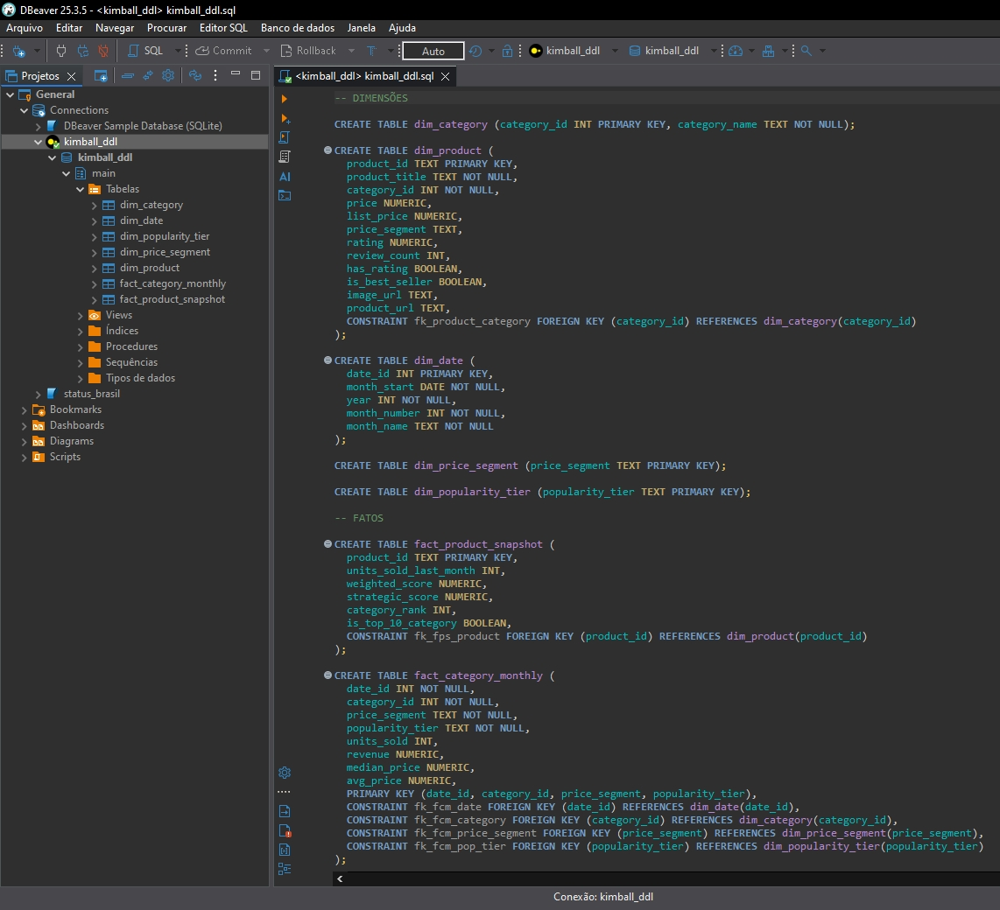

# Modelagem de Dados

## 📐 Abordagem escolhida: Kimball

A modelagem foi estruturada seguindo os princípios de **Ralph Kimball (modelo dimensional)**, organizando o domínio em esquema estrela (Star Schema):

- **Dimensões** → contexto, atributos descritivos e classificações
- **Fatos** → métricas quantitativas e indicadores de desempenho

A modelagem foi aplicada sobre a camada Curated, derivada da camada Standardized enriquecida com features semânticas via LLM.

### 🎯 Justificativa da Escolha

- Foco analítico e orientação a BI (Metabase / módulo de Visualização)
- Clareza na definição de granularidade (1 linha por produto)
- Separação explícita entre contexto (dimensões) e métricas (fatos)
- Facilidade de expansão futura (GenAI, similaridade, recomendação)
- Desempenho otimizado para consultas analíticas (Star Schema)
- Simplicidade de manutenção frente a arquiteturas mais complexas (ex: Data Vault) para escopo de BI

## 📌 Princípio de Modelagem

O modelo foi estruturado em formato Star Schema, com fatos centralizados e dimensões desnormalizadas para otimização analítica. O modelo foi dividido em dois Data Marts analíticos complementares:

1. **Snapshot por Produto →** análise de performance individual.
2. **Série Temporal Agregada →** análise estratégica por categoria e segmento.

## 🔎 Visão 1 – Catálogo e Performance (Snapshot por Produto)

### 🧩 Dimensões

> 📂 dim_product

| Campo               | Tipo    |
| ------------------- | ------- |
| product_sk (PK)     | integer |
| product_id (NK)     | text    |
| product_title       | text    |
| category_id (FK)    | integer |
| price               | numeric |
| list_price          | numeric |
| discount_percentage | numeric |
| price_segment       | text    |
| rating              | numeric |
| review_count        | integer |
| has_rating          | boolean |
| is_best_seller      | boolean |
| llm_brand_guess     | text    |
| llm_product_type    | text    |
| image_url           | text    |
| product_url         | text    |

> [!NOTE]
> O atributo `discount_percentage` é derivado de `price` e `list_price`, calculado na camada Standardized durante o processo de padronização dos dados.
>
> A inclusão de atributos como price, rating e atributos enriquecidos via LLM (`llm_brand_guess` e `llm_product_type`) na dimensão foi adotada por se tratar de snapshot descritivo do estado atual do produto, integrando dados estruturais da camada Standardized e atributos semânticos provenientes da camada Enriched.

> 📂 dim_category

| Campo            | Tipo    |
| ---------------- | ------- |
| category_id (PK) | integer |
| category_name    | text    |

### 📊 Fatos

> 🧾 fact_product_snapshot

- Granularidade: **1 linha = 1 produto**
- Chave Primária: **product_id**
- Chave Estrangeira: **product_sk (surrogate key)**

| Métrica               |
| --------------------- |
| units_sold_last_month |
| weighted_score        |
| strategic_score       |
| category_rank         |
| is_top_10_category    |

> [!NOTE]
> O uso de `product_sk` (surrogate key) permite estabilidade de relacionamento e facilita evolução do modelo, mesmo se `product_id` mudar na origem.

> 💼 Uso Principal

- Identificação de top produtos por categoria
- Priorização estratégica de catálogo
- Comparação de performance intra-categoria
- Base para ranking e recomendação futura

## 📈 Visão 2 – Série Temporal (Mensal por Categoria + Segmentações)

Essa abordagem foi adotada exclusivamente para fins analíticos e demonstração de modelagem temporal.

### 🧩 Dimensões

> 📅 dim_date

- Granularidade: 1 linha = 1 mês.

| Campo        |
| ------------ |
| date_id (PK) |
| month_start  |
| year         |
| month_number |
| month_name   |

> 💲 dim_price_segment

| Campo              |
| ------------------ |
| price_segment (PK) |

> ⭐ dim_popularity_tier

| Campo                |
| -------------------- |
| popularity_tier (PK) |

> 📂 dim_category (reutilizada)

A dimensão de categoria é compartilhada entre os fatos, garantindo consistência analítica entre análises de produto e análises temporais.

### 📊 Fatos

> 🧾 fact_category_monthly

- Granularidade: **1 linha = 1 mês + 1 categoria + 1 price_segment + 1 popularity_tier**
- Chave Primária composta: **date_id, category_id, price_segment, popularity_tier**

| Métrica      |
| ------------ |
| units_sold   |
| revenue      |
| median_price |
| avg_price    |

> [!NOTE]
> As métricas `median_price` e `avg_price` são agregações calculadas a partir da dimensão de produtos durante a geração da série temporal sintética.

> 💼 Uso Principal

- Análise de tendência e sazonalidade
- Comparação entre segmentos (budget vs premium)
- Análise por faixa de popularidade

> [!IMPORTANT]
> **Observação:** Como o dataset não possui data real, a série temporal foi gerada de forma sintética e reprodutível (seed fixa), ancorada em `units_sold_last_month` e em um fator de sazonalidade parametrizado.

## 🧠 Integração com a Plataforma de Dados

O modelo dimensional foi desenhado para ser materializado via pipeline na camada Curated, servindo como base estruturada para dashboards e Data Apps.

**A arquitetura permite:**

- Execução de consultas SQL analíticas diretamente no módulo de Visualização
- Evolução futura para modelos de recomendação e similaridade
- Integração direta com features enriquecidas via LLM
- Separação clara entre tratamento estrutural e consumo analítico

## ➿ Diagrama ERD

- Ferramenta utilizada: **dbdesigner (ERD)**
- Validação do DDL: **DBeaver + DuckDB**

#### 📌 Modelo Kimball

## 🧾 DDL (SQL)

O DDL foi estruturado de forma compatível com engines SQL amplamente utilizadas (PostgreSQL, DuckDB), reforçando portabilidade e viabilidade arquitetural.

- Arquivo: **[assets/sql/kimball_ddl.sql](../assets/sql/kimball_ddl.sql)**
- Engine de validação: **DuckDB (via DBeaver)**

### ✅ Validação do Modelo

A validação estrutural assegura que o modelo pode ser implantado em engines SQL compatíveis, reforçando viabilidade arquitetural e portabilidade.

O modelo dimensional foi validado executando o DDL no DBeaver utilizando DuckDB como engine local.

**Nesta etapa foi validado:**

- Estrutura das tabelas
- Definição de chaves primárias
- Definição de chaves estrangeiras
- Integridade relacional

#### 📌 DDL no DBeaver

> [!WARNING]
> A materialização definitiva do modelo será realizada por meio de pipelines automatizados descritos na etapa de engenharia de dados do projeto.
