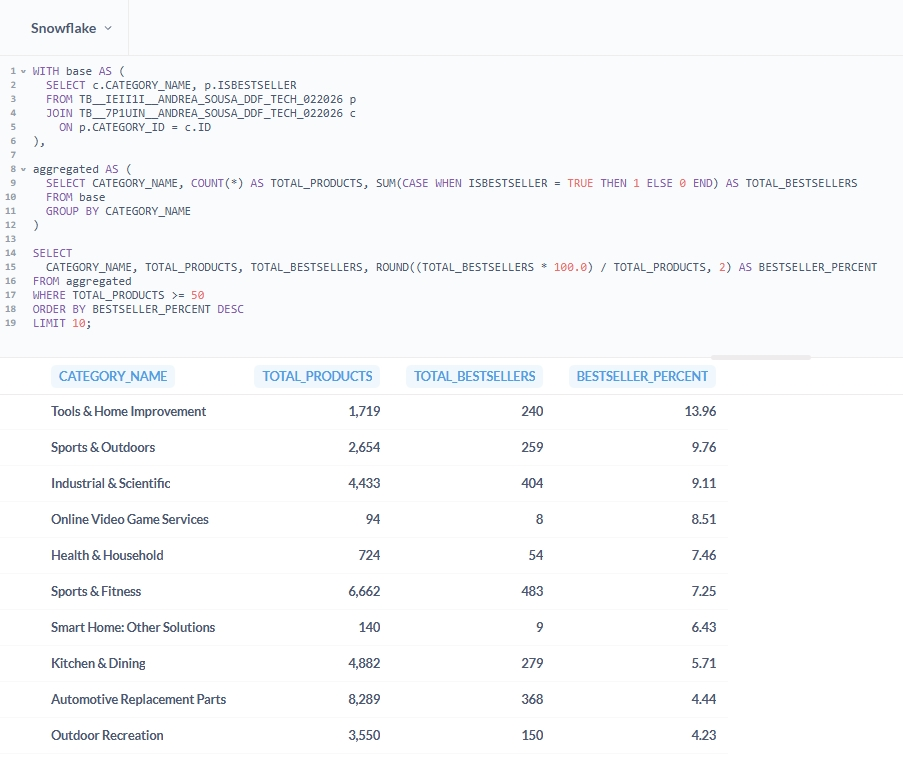
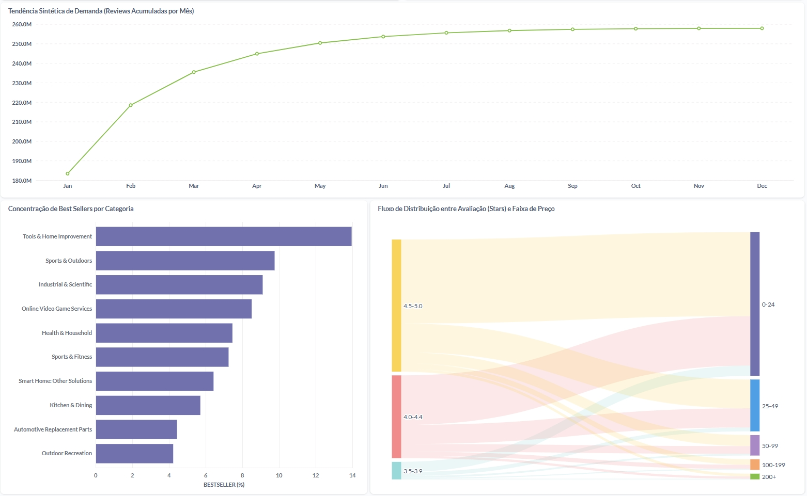

# Analisar: Dashboards na Dadosfera (Metabase) e Power BI

## 📊 Dashboard na Plataforma (Metabase)

Conforme solicitado no case técnico, foi criado um dashboard diretamente no módulo de Visualização da plataforma Dadosfera (Metabase).

> **Acesso ao dashboard:** [Amazon Catalog Intelligence](http://metabase-treinamentos.dadosfera.ai/public/dashboard/395efcb8-bcda-45bf-8c7e-c4c26b53f866)

### 🔎 Consultas SQL Utilizadas

As análises foram construídas a partir de consultas SQL salvas na plataforma, permitindo reutilização das métricas e composição das visualizações no dashboard.

1. Distribuição de produtos por categoria
2. Série temporal de unidades vendidas por categoria
3. Receita estimada por segmento de preço
4. Ranking de categorias por performance (strategic_score)
5. Distribuição por tier de popularidade
6. Análise comparativa entre best sellers e demais produtos

### 📷 Evidências

#### 📌 Query SQL e resultado



#### 📌 Dashboard salvo na Coleção




## 📊 Dashboard Externo (Power BI) – Extensão Analítica

Foi desenvolvido dashboard executivo no Power BI com três propósitos principais:

- Apresentar visão consolidada da performance do catálogo
- Analisar posicionamento estrutural por categoria e segmento de preço
- Incorporar variáveis enriquecidas por IA para geração de insights estratégicos

> [!IMPORTANT]
> O dashboard foi construído sobre a camada Curated, derivada do processamento estrutural e enriquecimento via LLM realizados nas etapas anteriores.

A replicação das análises em Power BI demonstra:

- Portabilidade do modelo dimensional (Star Schema)
- Independência de ferramenta de visualização
- Capacidade de integração com diferentes camadas analíticas
- Viabilidade de substituição arquitetural com manutenção do modelo de dados

## 🏗️ Arquitetura de Dados

### 🔹 Fonte de Dados

O relatório consome dados provenientes da camada Curated, composta por:

- dash_category_overview
- dash_category_segment_tier
- dash_ai_segment_analysis
- dash_top_product_types

**Essas tabelas foram geradas a partir de:**

- Tratamento e padronização da camada Standardized
- Engenharia de atributos e criação de métricas derivadas
- Enriquecimento semântico via LLM (marca, tipo de produto, atributos)
- Agregações analíticas para consumo em BI

### 🔹 Estratégia de Modelagem

A modelagem no Power BI segue abordagem orientada a medidas (measure-driven model):

- Métricas estratégicas implementadas via DAX
- Separação entre lógica de negócio e camada visual
- Organização de medidas por domínio analítico (performance, receita, segmentação)
- Uso de tabelas analíticas como base para cálculos derivados

**Essa abordagem garante:**

1. Clareza semântica
2. Reutilização de métricas
3. Escalabilidade do modelo analítico
4. Manutenção simplificada
5. Independência entre modelo de dados e visualizações

### 📷 Evidências

#### 📌 Modelo Semântico


## 📐 Estrutura do Dashboard

O dashboard foi estruturado em três níveis analíticos complementares.

### 🟣 Página 01 – Visão Executiva

- **Objetivo:** Fornecer panorama consolidado da saúde e estrutura do catálogo.
- **Principais Indicadores (KPIs):**
  - Total de produtos
  - Total de itens best seller
  - Preço médio do catálogo
  - Avaliação média do catálogo
  - Receita estimada (proxy)
- **Análises complementares:**
  - Distribuição de produtos por categoria
  - Categorias com maior volume de best sellers
  - Mapa de performance (Preço vs Avaliação)
  - Produto líder com narrativa dinâmica
  - Segmentação por faixa de preço

> [!TIP]
> **Pergunta que responde:**  
> Qual é o estado geral de performance e posicionamento do catálogo?

### 📷 Evidências:

#### 📌 Página 1 - Executive Overview


### 🟠 Página 02 – Segmentação de Mercado

- **Objetivo:** Analisar o posicionamento estrutural do catálogo por segmento de preço e popularidade.
- **Componentes principais:**
  - Heatmap de mix por categoria e price_segment
  - Indicador de Revenue Proxy
  - Identificação de segmento dominante
  - Identificação de tier de popularidade dominante
  - Matriz de posicionamento (Preço Médio vs Avaliação Média)
  - Alternância dinâmica entre Preço Médio e Revenue Proxy (Field Parameter)
- **Revenue Proxy:**
  - Métrica estimada como: `Receita Proxy = Σ (Preço médio × Unidades vendidas)`
  - Utilizada como indicador direcional de potencial de monetização

> [!TIP]
> **Pergunta que responde:**  
> Como o catálogo está distribuído estruturalmente em termos de valor, monetização e popularidade?

### 📷 Evidências:

#### 📌 Página 2 - Segmentation


### 🔵 Página 03 – Inteligência Estratégica com IA

- **Objetivo:** Traduzir o enriquecimento via LLM em inteligência analítica acionável.
- **Variáveis derivadas por IA:**
  - llm_product_type
  - llm_brand_guess
  - Classificação semântica de produtos
  - Consolidação por tipo inferido
- **Componentes principais:**
  - Mix de tipos de produto identificados pela IA
  - Marcas inferidas com maior volume de produtos
  - Matriz estratégica de posicionamento (Preço Médio vs Avaliação Média)
  - Mapa de concentração por segmento de preço
  - Texto estratégico dinâmico com recomendação de ação
- **Papel estratégico:**
  - Conectar: `Dados → Sinal → Interpretação → Ação recomendada`
  - Evidenciar ganho analítico proporcionado pelo enriquecimento semântico

> [!TIP]
> **Pergunta que responde:**  
> Onde a IA identifica concentração de demanda e quais decisões estratégicas podem ser priorizadas?

### 📷 Evidências:

#### 📌 Página 3 - AI Insights


## 🧮 Organização das Medidas

As medidas foram organizadas em pastas temáticas:

📁 **Executive Overview:** Métricas consolidadas de catálogo e identificação de produto líder.  
📁 **Segmentation:** Métricas estruturais, segmentação e Revenue Proxy.  
📁 **AI Insights:** Métricas derivadas da camada enriquecida via LLM.

> [!NOTE]
> Todas as métricas estratégicas foram implementadas via DAX, evitando agregações diretas na camada visual e garantindo separação entre modelo semântico e apresentação.

### 📷 Evidências:

#### 📌 Organização de medidas em subpastas


## 🧠 Princípios de Design

- Tema escuro executivo
- Hierarquia visual clara (KPIs → Estrutura → Insight)
- Narrativas dinâmicas para contextualização estratégica
- Consistência de métricas, unidade monetária e escalas
- Separação explícita entre camada semântica (modelo) e camada visual (relatório)

### 📷 Evidências:

#### 📌 Texto dinâmico com DAX


O texto foi construído utilizando medida em DAX, permitindo atualização dinâmica conforme qualquer filtro ou seleção aplicada na página.

**Essa abordagem possibilita:**

- Geração automática de narrativa contextual
- Interpretação estratégica baseada nos filtros ativos
- Tradução de métricas quantitativas em insight acionável
- Conexão direta entre análise visual e recomendação executiva

```java
AI Strategic Insight (Text) =
VAR TopRow = TOPN(1, ALLSELECTED(dash_ai_segment_analysis), dash_ai_segment_analysis[total_units], DESC)
VAR TopType = MAXX(TopRow, dash_ai_segment_analysis[llm_product_type])
VAR TopUnits = MAXX(TopRow, dash_ai_segment_analysis[total_units])
VAR AvgPrice = MAXX(TopRow, dash_ai_segment_analysis[avg_price])
VAR AvgRating = MAXX(TopRow, dash_ai_segment_analysis[avg_rating])

VAR Interpretation = SWITCH(TRUE(),
  ISBLANK(AvgRating), "Quality perception cannot be validated due to limited reviews.",
  AvgRating >= 4.6, "This indicates exceptional customer satisfaction and strong product–market fit.",
  AvgRating >= 4.2, "This suggests consistent customer satisfaction and a reliable demand signal.",
  AvgRating >= 3.8, "This suggests solid demand with room to improve customer experience.",
  AvgRating >= 3.3, "This suggests moderate satisfaction and potential friction points to address.",
  "This suggests demand may be price-driven, with potential quality and conversion risks."
)

VAR NextAction = SWITCH(TRUE(),
  ISBLANK(AvgRating), "Action: prioritize review collection to validate quality before scaling.",
  AvgRating >= 4.6, "Action: scale visibility (search/ads/recommendations) and protect availability.",
  AvgRating >= 4.2, "Action: scale distribution and maintain pricing discipline.",
  AvgRating >= 3.8, "Action: optimize listing content and post-purchase experience to lift ratings.",
  AvgRating >= 3.3, "Action: investigate complaints/returns and remove key friction points.",
  "Action: investigate quality issues and returns risk before increasing exposure."
)

RETURN
"Within the AI-Enriched sample, '" & TopType &
"' leads demand with " & FORMAT(TopUnits, "#,0", "en-US") & " units sold. " &
"It is priced at $" & FORMAT(AvgPrice, "0.00", "en-US") &
" with an average rating of " & FORMAT(AvgRating, "0.0", "en-US") & "★. " &
UNICHAR(10) & UNICHAR(10) & Interpretation & " " &
"Demand concentration suggests category-level dominance potential. " & NextAction
```

## 🏁 Resultado

#### 📌 Dashboard publicado no [Power BI Online](https://app.powerbi.com/view?r=eyJrIjoiNjhmNDg5MWMtMGU0Yi00ZjI5LTg5MTMtNTRiNTM5Y2RkOTAzIiwidCI6ImEzZTU3Zjc1LTU5YTktNDFkOS05ZGIwLTA0YmM0ODg2YWY3NyJ9&pageName=5f22c10194a1a41d956c)

**O dashboard permite:**

- Monitoramento executivo do catálogo
- Análise estrutural por segmento de preço e popularidade
- Avaliação de concentração de monetização (Revenue Proxy)
- Exploração de insights derivados de IA (marca e tipo inferido)
- Tomada de decisão orientada por métricas consolidadas

O resultado demonstra a evolução de uma camada analítica tradicional para uma arquitetura de inteligência aumentada, combinando modelagem dimensional, enriquecimento semântico via IA e exploração interativa dos dados.
