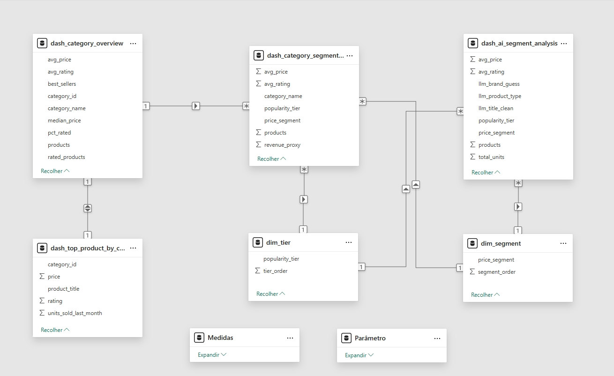
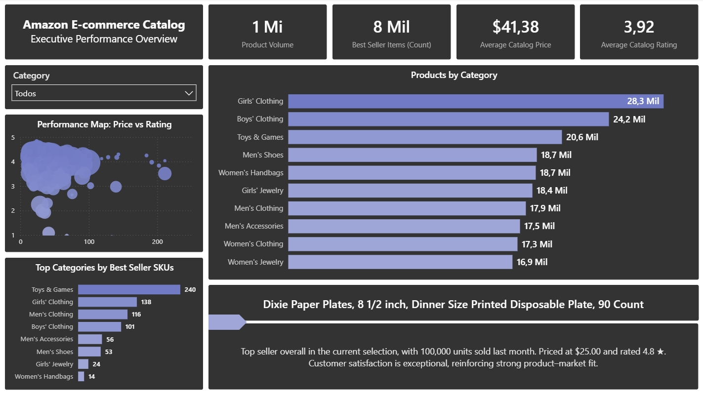
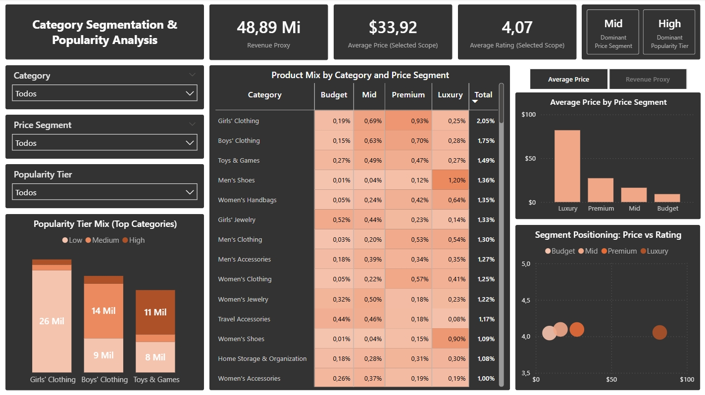
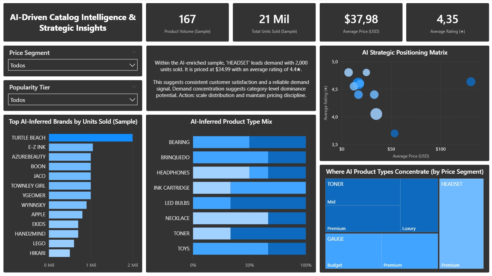
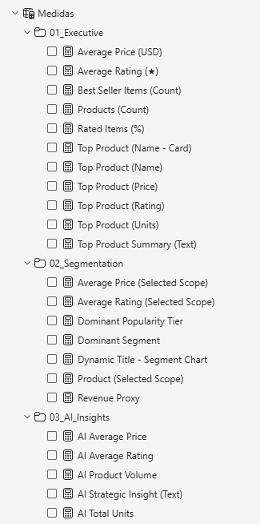
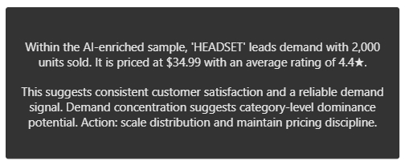

# Analisar: Dashboards na Dadosfera (Metabase) e Power BI

## 📊 Dashboard na Plataforma Dadosfera (Metabase)

Conforme solicitado no Item 7 do case, foi criado um dashboard diretamente no módulo de Visualização da Dadosfera (Metabase), utilizando o identificador da tabela na camada CURATED.

### 🔎 Consultas SQL Utilizadas

As análises foram construídas com base em queries SQL salvas na plataforma, incluindo:

1. Distribuição de produtos por categoria
2. Série temporal de unidades vendidas por categoria
3. Receita proxy por segmento de preço
4. Ranking de categorias por performance
5. Distribuição por tier de popularidade

### 📷 Evidências

#### 📌 Query SQL


#### 📌 Resultado da Query


#### 📌 Dashboard salvo na Coleção


## 📊 Dashboard Externo (Power BI) – Bônus

Desenvolver um dashboard executivo no Power BI com três propósitos principais:

- Apresentar uma visão consolidada da performance do catálogo
- Analisar o posicionamento estrutural por categoria e segmento de preço
- Incorporar variáveis enriquecidas por IA para geração de insights estratégicos

> [!IMPORTANT]
> O dashboard foi construído sobre a camada Gold, derivada do processamento e enriquecimento realizado nos notebooks anteriores.

A replicação das análises em Power BI demonstra a portabilidade do modelo dimensional e reforça a viabilidade de substituição arquitetural, conforme exigido no Item 10.

## 🏗️ Arquitetura de Dados

### 🔹 Fonte de Dados

O relatório consome dados provenientes da camada CURATED, composta por:

- dash_category_overview
- dash_category_segment_tier
- dash_ai_segment_analysis
- dash_top_product_types

**Essas tabelas foram geradas a partir de:**

- Limpeza e padronização da camada STANDARDIZED
- Feature engineering
- Enriquecimento via LLM (extração de marca, tipo de produto, atributos)
- Agregações estratégicas

### 🔹 Estratégia de Modelagem

A modelagem segue abordagem orientada a medidas (measure-driven model):

- Métricas estratégicas implementadas via DAX
- Separação entre lógica de negócio e camada visual
- Agrupamento organizado de medidas por página

**Essa abordagem garante:**

1. Clareza semântica
2. Reutilização de métricas
3. Escalabilidade do modelo
4. Manutenção simplificada

### 📷 Evidências

#### 📌 Modelo Semântico



## 📐 Estrutura do Dashboard

O dashboard foi estruturado em três níveis analíticos.

### 🟣 Página 01 – Visão Executiva

- **Objetivo:** Fornecer um panorama geral da saúde e estrutura do catálogo.
- **Principais Indicadores:**
  - Total de produtos
  - Total de itens best seller
  - Preço médio do catálogo
  - Avaliação média do catálogo
- **Análises complementares:**
  - Distribuição de produtos por categoria
  - Categorias com maior volume de best sellers
  - Mapa de performance (Preço vs Avaliação)
  - Produto líder com narrativa dinâmica

> [!TIP]
> **Pergunta que responde:**  
> Como está o desempenho geral do catálogo?

### 📷 Evidências:

#### 📌 Página 1 - Executive Overview



### 🟠 Página 02 – Segmentação de Mercado

- **Objetivo:** Analisar o posicionamento estrutural do catálogo por segmento de preço e popularidade.
- **Componentes principais**
  - Heatmap de mix por categoria e price segment
  - Indicador de Revenue Proxy
  - Segmento dominante
  - Tier de popularidade dominante
  - Matriz de posicionamento (Preço vs Avaliação)
  - Alternância dinâmica entre Preço Médio e Revenue Proxy (Field Parameter)
- **Revenue Proxy:**
  - Métrica estimada como: `Receita Proxy = Σ (Preço médio × Unidades vendidas)`
  - Utilizada como sinal direcional de monetização, não como receita contábil oficial.

> [!TIP]
> **Pergunta que responde:**  
> Como o catálogo está distribuído estruturalmente em termos de valor e popularidade?

### 📷 Evidências:

#### 📌 Página 2 - Segmentation



### 🔵 Página 03 – Inteligência Estratégica com IA

- **Objetivo:** Traduzir o enriquecimento via LLM em inteligência acionável.
- **Variáveis derivadas por IA:**
  - llm_product_type
  - llm_brand_guess
  - Classificação semântica de produtos
  - Consolidação por tipo inferido
- **Componentes principais:**
  - Mix de tipos de produto identificados pela IA
  - Marcas inferidas com maior volume
  - Matriz estratégica de posicionamento (Preço vs Avaliação)
  - Mapa de concentração por segmento de preço
  - Texto estratégico dinâmico com recomendação de ação
- **Papel estratégico:**
  - Conectar: `Dados → Sinal → Interpretação → Ação recomendada`

> [!TIP]
> **Pergunta que responde:**  
> Onde a IA identifica concentração de demanda e quais decisões estratégicas são recomendadas?

### 📷 Evidências:

#### 📌 Página 3 - AI Insights



## 🧮 Organização das Medidas

As medidas foram organizadas em pastas:

📁 **Executive Overview:** Métricas gerais de catálogo e produto líder.  
📁 **Segmentation:** Métricas estruturais, segmentação e revenue proxy.  
📁 **AI Insights:** Métricas derivadas da camada enriquecida por LLM.

> [!NOTE]
> Todas as métricas estratégicas são implementadas via DAX, evitando agregações diretas na camada visual.

### 📷 Evidências:

#### 📌 Organização de medidas em subpastas



## 🧠 Princípios de Design

- Tema escuro executivo
- Hierarquia visual clara (KPIs → Estrutura → Insight)
- Narrativas dinâmicas para contextualização
- Consistência de métricas e moeda
- Separação entre camada semântica e visual

### 📷 Evidências:

#### 📌 Texto dinâmico com DAX



O texto foi criado para alterar, dinamicamente, a partir de qualquer filtro ou seleção feita na página:

```java
AI Strategic Insight (Text) =
VAR TopRow = TOPN(1, ALLSELECTED(dash_ai_segment_analysis), dash_ai_segment_analysis[total_units], DESC)
VAR TopType = MAXX(TopRow, dash_ai_segment_analysis[llm_product_type])
VAR TopUnits = MAXX(TopRow, dash_ai_segment_analysis[total_units])
VAR AvgPrice = MAXX(TopRow, dash_ai_segment_analysis[avg_price])
VAR AvgRating = MAXX(TopRow, dash_ai_segment_analysis[avg_rating])

VAR Interpretation = SWITCH(TRUE(),
        ISBLANK(AvgRating),
        "Quality perception cannot be validated due to limited reviews.",
        AvgRating >= 4.6,
        "This indicates exceptional customer satisfaction and strong product–market fit.",
        AvgRating >= 4.2,
        "This suggests consistent customer satisfaction and a reliable demand signal.",
        AvgRating >= 3.8,
        "This suggests solid demand with room to improve customer experience.",
        AvgRating >= 3.3,
        "This suggests moderate satisfaction and potential friction points to address.",
        "This suggests demand may be price-driven, with potential quality and conversion risks."
)

VAR NextAction = SWITCH(TRUE(),
        ISBLANK(AvgRating),
        "Action: prioritize review collection to validate quality before scaling.",
        AvgRating >= 4.6,
        "Action: scale visibility (search/ads/recommendations) and protect availability.",
        AvgRating >= 4.2,
        "Action: scale distribution and maintain pricing discipline.",
        AvgRating >= 3.8,
        "Action: optimize listing content and post-purchase experience to lift ratings.",
        AvgRating >= 3.3,
        "Action: investigate complaints/returns and remove key friction points.",
        "Action: investigate quality issues and returns risk before increasing exposure."
)

RETURN
"Within the AI-enriched sample, '" & TopType &
"' leads demand with " & FORMAT(TopUnits, "#,0", "en-US") & " units sold. " &
"It is priced at $" & FORMAT(AvgPrice, "0.00", "en-US") &
" with an average rating of " & FORMAT(AvgRating, "0.0", "en-US") & "★. " &
UNICHAR(10) & UNICHAR(10) & Interpretation & " " &
"Demand concentration suggests category-level dominance potential. " & NextAction
```

## 🏁 Resultado

#### 📌 Dashboard publicado no [Power BI Online](https://app.powerbi.com/view?r=eyJrIjoiNjhmNDg5MWMtMGU0Yi00ZjI5LTg5MTMtNTRiNTM5Y2RkOTAzIiwidCI6ImEzZTU3Zjc1LTU5YTktNDFkOS05ZGIwLTA0YmM0ODg2YWY3NyJ9&pageName=5f22c10194a1a41d956c)

**O dashboard permite:**

- Monitoramento executivo
- Análise estrutural por segmento
- Avaliação de concentração de monetização
- Integração prática de IA em decisões de negócio

Consolida a transição da camada analítica tradicional para uma camada de inteligência aumentada.
