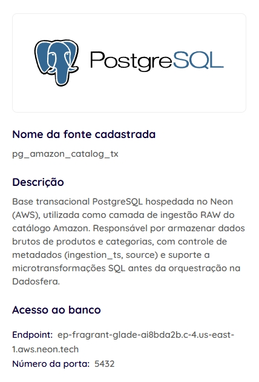
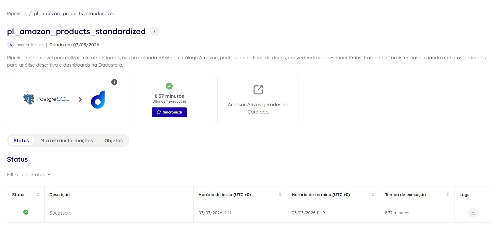
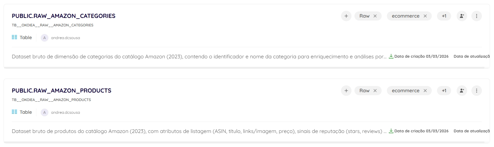

# Pipelines de Dados

Esta etapa apresenta a estratégia de orquestração e automação das transformações de dados implementadas ao longo do projeto.

O objetivo é garantir que todas as etapas de ingestão, tratamento, enriquecimento e materialização analítica possam ser executadas de forma automatizada e auditável.

## 🎯 Objetivo do Pipeline

O pipeline foi projetado para:

- Automatizar o fluxo de processamento de dados
- Garantir reprodutibilidade das transformações
- Permitir execução incremental
- Centralizar governança de dados
- Materializar a camada **Curated** utilizada por dashboards e Data Apps

## 🧱 Arquitetura do Pipeline

O pipeline segue a arquitetura de camadas adotada ao longo do projeto:

`RAW → Standardized → Enriched → Curated`

Cada etapa possui responsabilidade clara dentro do fluxo de processamento.

| Camada       | Responsabilidade                |
| ------------ | ------------------------------- |
| RAW          | Ingestão de dados brutos        |
| Standardized | Limpeza, tipagem e padronização |
| Enriched     | Extração de features via LLM    |
| Curated      | Modelagem analítica dimensional |

## ⚙️ Estrutura do Pipeline

O pipeline foi estruturado em etapas sequenciais.

### 1️⃣ Ingestão (RAW)

Responsável pela leitura dos dados originais carregados na plataforma.

- **Ações executadas:**
  - Leitura das tabelas RAW
  - Validação de estrutura
  - Verificação de volume
- **Entradas**
  - RAW_ECOMMERCE_AMAZON_PRODUCTS
  - RAW_ECOMMERCE_AMAZON_CATEGORIES
- **Saída**
  - Dataset bruto preparado para transformação.

### 2️⃣ Padronização (Standardized)

Etapa responsável pelo tratamento e normalização dos dados.

- **Transformações aplicadas**
  - Padronização de nomes de colunas
  - Conversão de tipos
  - Tratamento e validação de valores nulos
  - Criação de variáveis derivadas
- **Variáveis criadas**
  - price_segment
  - has_rating
  - weighted_score
  - popularity_tier
  - discount_percentage
- **Saída**
  - Tabela estruturada para modelagem analítica.

### 3️⃣ Enriquecimento via IA (Enriched)

Etapa responsável pela extração de atributos semânticos utilizando LLM.

- **Entrada:**
  - product_title
- **Features extraídas**
  - llm_brand_guess
  - llm_product_type
  - llm_attributes_json
  - llm_keywords_json
  - llm_title_clean
- **Estratégia aplicada**
  - Amostragem estratificada por categoria, price_segment e popularity_tier
  - Controle de custo por tokens
  - Validação de JSON retornado
- **Saída**
  - Tabela enriquecida semanticamente.

### 4️⃣ Modelagem Analítica (Curated)

Responsável pela materialização das tabelas dimensionais e fatos analíticos utilizados nas análises.

| Tabelas geradas       | Tipo     |
| --------------------- | -------- |
| dim_product           | Dimensão |
| dim_category          | Dimensão |
| dim_date              | Dimensão |
| dim_price_segment     | Dimensão |
| dim_popularity_tier   | Dimensão |
| fact_product_snapshot | Fato     |
| fact_category_monthly | Fato     |

Essa etapa consolida o modelo dimensional utilizado nos dashboards e no Data App.

## 🔄 Estratégia de Execução

O pipeline foi projetado para suportar execução incremental.

**Estratégias utilizadas**

- Reprocessamento idempotente
- Validação de qualidade antes da materialização
- Separação de camadas analíticas
- Persistência intermediária em Parquet e materialização das tabelas analíticas

## 🧪 Validação do Pipeline

Antes da materialização final foram aplicadas verificações automáticas:

- Unicidade de product_id
- Consistência referencial com category_id
- Domínio de valores numéricos
- Validação de tipagem

Essas validações garantem integridade antes da publicação da camada analítica.

## 📊 Benefícios Arquiteturais

A adoção de pipelines automatizados permite:

- Redução de processamento manual
- Reexecução segura de transformações
- Versionamento e rastreabilidade da lógica de transformação de dados
- Governança centralizada
- Escalabilidade do processamento

## 🔁 Evolução para Produção

Em cenário produtivo, o pipeline pode evoluir para:

- Execução agendada e orquestrada
- Processamento incremental
- Monitoramento de falhas
- Controle de custos de LLM
- Atualização automática de dashboards

## 🧠 Papel Estratégico

O pipeline conecta todas as etapas do ciclo de vida de dados:

`Ingestão → Qualidade → Enriquecimento → Modelagem → Consumo Analítico`

Essa estrutura transforma um fluxo manual de análise em **um sistema de dados reexecutável**, capaz de sustentar aplicações analíticas e de IA em escala.

# 📷 Evidências

#### 📌 Coletar > Conexões

#### 📌 Coletar > Pipelines

#### 📌 Explorar > Catálogo

# 🏁 Resultado

Com a implementação do pipeline:

- o processamento torna-se **automatizado**
- as transformações tornam-se **reprodutíveis**
- a camada analítica torna-se **governável**

O pipeline consolida a transição de um fluxo experimental de notebooks para uma arquitetura de dados estruturada, reexecutável e pronta para evolução produtiva.
