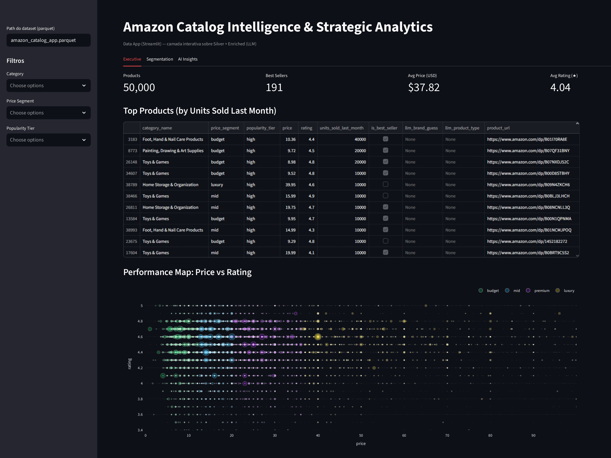
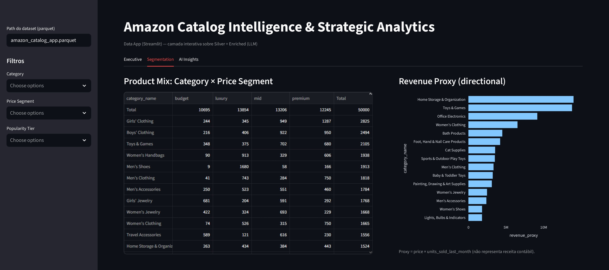
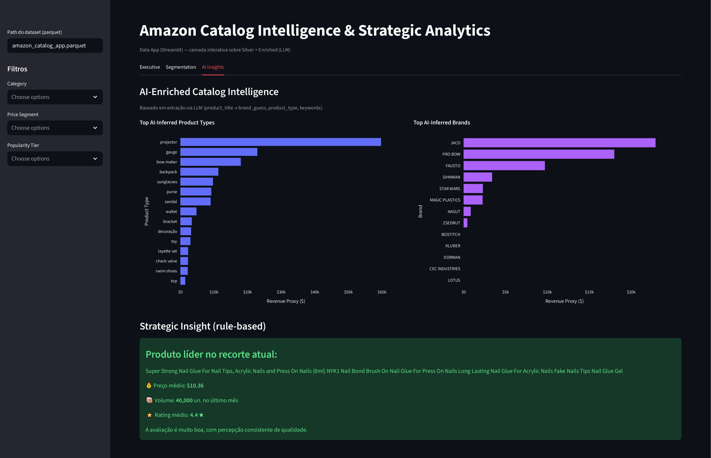

# Data App (Streamlit)

Esta etapa entrega um **Data App em Streamlit** para exploração interativa do catálogo Amazon, utilizando a base STANDARDIZED enriquecida com features via LLM (camada ENRICHED).

## 🎯 Objetivo

O objetivo é disponibilizar uma experiência leve e navegável para:

- **Explorar o catálogo por:** Categoria, Price Segment e Popularity Tier
- **Visualizar relações entre:** Preço x Rating
- **Analisar mix por:** Price Segment e por Revenue Proxy
- **Consumir atributos enriquecidos por IA:** Brand Guess e Product Type

Camada de consumo interativo (Data App) que complementa o dashboard executivo:

- **Data App (Streamlit):** exploração livre, filtros, tabelas e gráficos com granularidade

> [!NOTE]
> Embora o Data App esteja hospedado externamente (Streamlit Community Cloud), sua camada de dados segue o modelo arquitetural proposto na Dadosfera (RAW → STANDARDIZED → ENRICHED → CURATED), demonstrando portabilidade da solução.

## 🧾 Entradas e Saídas

### Entrada

- Notebook no Google Colab: [Data APP Streamlit](../notebooks/04_data_app_streamlit.ipynb)
- Dataset parquet do app: [Amazon Catalog APP](../app/amazon_catalog_app.parquet)
- Arquivo da aplicação: [Streamlit Data APP](../app/app.py)
- Conteúdo (colunas esperadas, exemplo):
  - `product_id`, `product_title`, `category_name`
  - `price`, `rating`, `units_sold_last_month`, `is_best_seller`
  - `price_segment`, `popularity_tier`
  - `llm_brand_guess`, `llm_product_type`, `llm_title_clean`

### Saída

#### 📌 Aplicação Streamlit: [Amazon Catalog Intelligence](https://acs-amazon-catalog-app.streamlit.app/)

O notebook no Google Colab gera o arquivo parquet. Esse arquivo é utilizado no script do app para executar a aplicação via Streamlit localmente.

> [!NOTE]
> O arquivo parquet foi baixado e mantido na pasta `app/` para facilitar a execução local.  
> Em cenário produtivo, recomenda-se apontar para um storage/URL ou pipeline de publicação.  
> A arquitetura ideal prevê leitura direta da camada CURATED materializada via pipeline na Dadosfera.

## 🧱 Estrutura no repositório

Arquivos criados/organizados nesta etapa:

- `app/app.py` — aplicação Streamlit
- `app/requirements.txt` — dependências do app
- `app/README.md` — instruções rápidas de execução
- `app/.streamlit/config.toml` (se existir) — configuração visual e de tema

## ▶️ Como rodar localmente

Abra o terminal na raiz do repositório e rode:

```bash
cd app
python -m venv venv

# Windows
.venv\Scripts\activate

# Mac/Linux
source venv/bin/activate

pip install -r requirements.txt
streamlit run app.py
```

## 🧭 Navegação do app

O app foi estruturado em 3 abas:

- **Executive**
  - Cards: Products, Best Sellers, Avg Price, Avg Rating
  - Tabela: Top Products (Units Sold Last Month)
  - Scatter: Performance Map (Price vs Rating)
- **Segmentation**
  - Tabela: Product Mix (Category x Price Segment)
  - Gráfico: Revenue Proxy (directional)
- **AI Insights**
  - Ranking por IA (ex: Revenue Proxy por llm_product_type e/ou llm_brand_guess)
  - Objetivo: destacar padrões e concentração por atributos inferidos via LLM

## 🧠 Papel Estratégico do Data App

O Data App atua como camada de exploração livre, permitindo análises ad-hoc e inspeção granular de produtos individuais, complementando o dashboard executivo.

Enquanto o dashboard responde perguntas estruturadas, o Data App permite investigação interativa e descoberta de padrões.

### 📷 Evidências

#### 📌 Executive



#### 📌 Segmentation



#### 📌 AI Insights



## 🔁 Integração com Pipeline

A versão atual utiliza dataset exportado em Parquet para fins de PoC.

**A arquitetura final prevê:**

- Pipeline automatizado na Dadosfera
- Publicação da camada CURATED
- Consumo direto via conexão segura ou endpoint de dados
